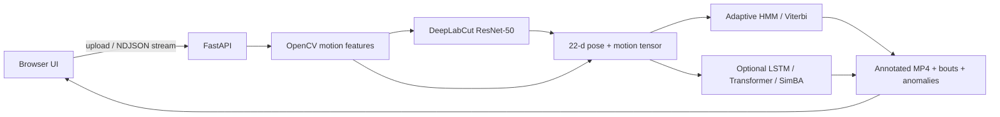

# Rat Behavior Intelligence

End-to-end **computer vision pipeline** that turns raw rodent video into timestamped behavior labels, drug-condition anomalies, and a reviewable annotated clip.

Built for a behavioral neuroscience lab (meth / alcohol / baseline self-administration). Designed to run on a **laptop with limited labeled video** — no GPU cluster required for the default path.

```
raw video  →  motion features  →  DeepLabCut pose (ResNet-50)  →  temporal decoder  →  8-class bouts + anomalies
```

## Why it exists

Scoring hours of operant-chamber video by hand is slow and inconsistent. This app automates first-pass classification of eight behavioral states, overlays predictions on the video, and flags sessions that deviate from condition-specific norms so a researcher reviews the interesting minutes instead of the whole tape.

## ML system

### 1. Pose estimation (CNN)

When DeepLabCut is available, a **PyTorch ResNet-50** heatmap model tracks keypoints (`nose`, `upper_back`, `lower_back`, `tail_base`, `tail_tip`; 16-point skeleton ready for ears, paws, spine). Pose traces yield curvature, turning rate, body length, and grooming-local motion.

### 2. Feature representation

Each frame is a **22-dimensional** vector: speed, acceleration, spatial span, direction change, confinement (pace/span), rolling statistics, plus pose geometry when present. Features are **resolution- and session-normalized** so a 240p laptop clip and a larger arena video share the same decision surface.

### 3. Temporal classification (default: CPU HMM)

The production decoder is an **adaptive Hidden Markov Model + Viterbi**:

- Soft emissions for all eight states (not winner-take-all pixel thresholds)
- Sticky, biologically plausible transitions (freeze ↛ locomotor burst)
- **Condition-conditioned priors** — meth boosts stereotypy / locomotion; alcohol boosts freeze / rest / hesitation
- Short-bout hysteresis so one-frame flicker does not become a labeled event

This is a deliberate ML-engineering tradeoff: full LSTM/Transformer training needs labeled sequences and GPU time the lab did not have. The HMM is the model that actually ships.

### 4. Sequence models (optional, same interface)

When a checkpoint exists, the same feature tensor feeds:

| Mode | Model | When it runs |
| --- | --- | --- |
| `adaptive_hmm` | Session-adaptive HMM + Viterbi | **Default** — CPU, no checkpoint |
| `pytorch_temporal` | Bidirectional LSTM with attention, or Transformer encoder | `CLASSIFIER_MODEL_PATH` set |
| `simba` | SimBA-style pose-feature LSTM | DLC CSV + `SIMBA_MODEL_PATH` |

Training utilities (class-weighted CE, sequence windows, stratified k-fold, weak labels from the HMM) live in `backend/app/training.py`.

### 5. Condition-aware anomaly detection

Predicted time-shares are compared to normative ranges per condition (`baseline`, `saline`, `meth`, `amphetamine`, `cocaine`, `alcohol`, `morphine`). Deviations are severity-scored and used to raise review priority.

**Behaviors:** `exploration` · `locomotor_burst` · `freezing_candidate` · `grooming_candidate` · `hesitation` · `stereotypy_candidate` · `turning_pattern` · `resting`

## Architecture



- **Backend:** FastAPI, OpenCV, NumPy, PyTorch (optional), DeepLabCut (optional)
- **Frontend:** static HTML/JS — no build step
- **Memory:** two-pass video I/O so decoded frames are not held in RAM
- **Degradation:** no DLC → motion-only HMM; no LLM → rule-based observer; no FFmpeg → raw MP4

## Quick start

```bash
cd backend
python3 -m venv .venv
source .venv/bin/activate
pip install -r requirements.txt
python -m uvicorn app.main:app --reload
```

Open [http://127.0.0.1:8000](http://127.0.0.1:8000), drop a video, leave **Classifier** on **Adaptive HMM (on-device)**, set **Condition** if known, run analysis.

```bash
# optional: check DLC / checkpoints / local LLM
python -m app.cli doctor

pytest tests/test_api.py tests/test_adaptive_classifier.py
```

## What you get back

- Annotated MP4 with behavior overlay (and skeleton if pose ran)
- Frame-level labels and bout segments (`timeline.json`)
- Behavior time-share, dominant state, review priority
- Condition anomaly chips vs expected distributions
- Timestamped observer notes (optional LLM summary if `LLM_PROVIDER` is set)

Artifacts: `backend/data/uploads/` and `backend/data/processed/annotated_sessions/`.

## Stack

`Python` · `PyTorch` · `DeepLabCut` · `OpenCV` · `NumPy` · `HMM / Viterbi` · `LSTM / Transformer` · `FastAPI` · `scikit-learn`

---

## DeepLabCut labeling (lab workflow)

The bundled project is `dlc_project/RatTracking-Noemia-2025-11-17`. Expanded 16-point template: `dlc_project/rat_pose_expanded_config_template.yaml`.

```bash
cd backend
bash run_dlc_labeling.sh prepare-video /absolute/path/to/rat_video.mp4
bash run_dlc_labeling.sh label --image-folder <video_stem>
bash run_dlc_labeling.sh check-labels
```

Labeling needs a desktop GUI (napari). This does not run on GitHub Pages — video analysis requires the FastAPI backend.
